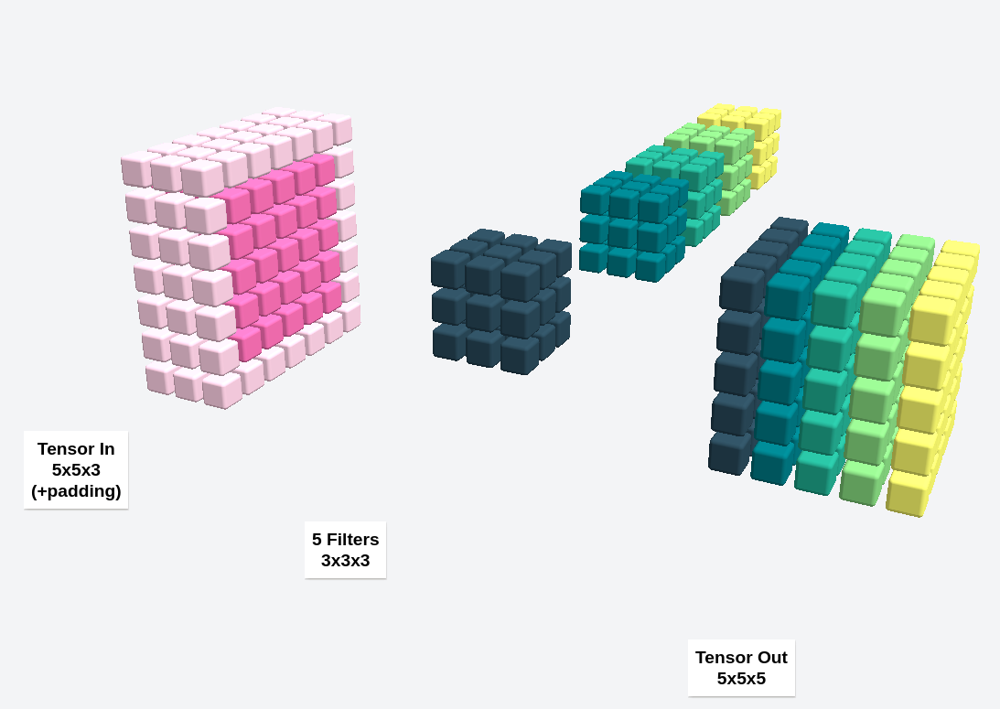

# Convviz

[Here](https://convviz.netlify.app/) it is in action. 

Visualize the tensors and filters of a typical CNN convolution.

Tools used:
- ThreeJS
- SolidJS
- ChromaJS

Inspired by [Animated AI](https://www.youtube.com/watch?v=V9ZYDCnItr0&t=93s).